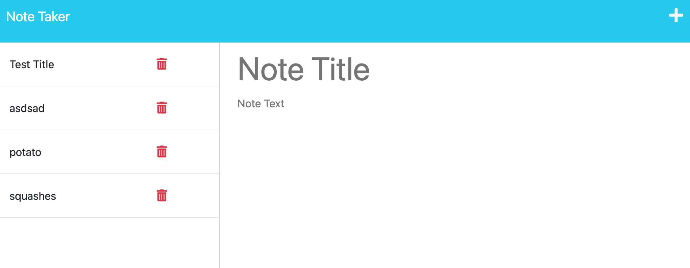

# Note-Taker
5.26.23  An application that can be used to write and save notes so that users can organize their thoughts and keep track of tasks that need to be completed

## Acceptance Criteria

1.WHEN I open the Note Taker THEN I am presented with a landing page with a link to a notes page

2.WHEN I click on the link to the notes page THEN I am presented with a page with existing notes listed in the left-hand column, plus empty fields to enter a new note title and the note’s text in the right-hand column

3.WHEN I enter a new note title and the note’s text THEN a Save icon appears in the navigation at the top of the page

4.WHEN I click on the Save icon THEN the new note I have entered is saved and appears in the left-hand column with the other existing notes

5.WHEN I click on an existing note in the list in the left-hand column THEN that note appears in the right-hand column

6.WHEN I click on the Write icon in the navigation at the top of the page THEN I am presented with empty fields to enter a new note title and the note’s text in the right-hand column

## Deployed Page Url

https://note-taker-in-express-0572647b6f7f.herokuapp.com/

 
## Screenshot of App

